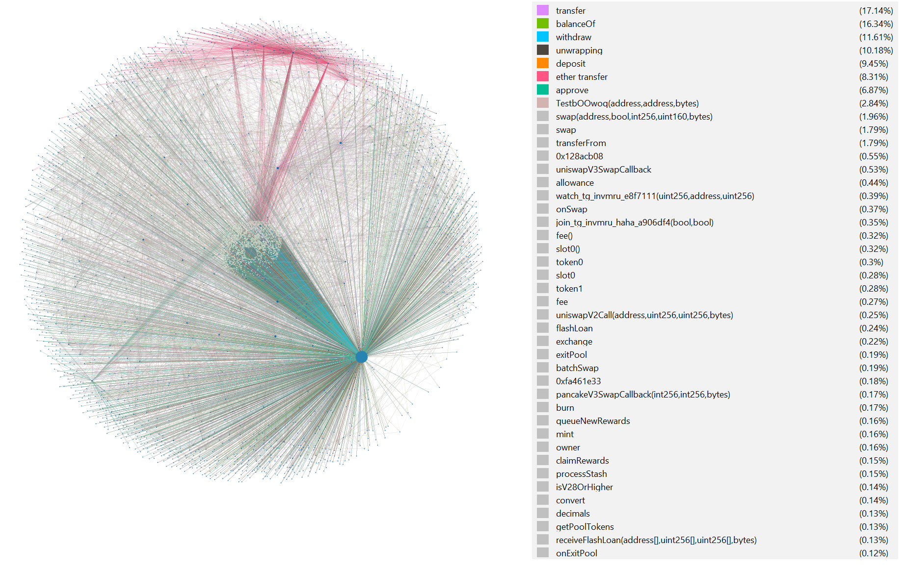

# eth-tracker


*Gephi-visualized example trace graph*
***

**1. setup .env file**

```
ETHERSCAN_API = <your etherscan api key>
ETH_MAINNET_EXECUTION_RPC = <your rpc provider>
```

---
**2. run command to see implemented functions**

```
python main.py -h
```
example output:

```
usage: main.py [-h] {contracts_from,contracts_to,txs_from,txs_to,traces_from,traces_to,apply_filter,get_logs,trace_filter,trace_out,decode_trace,price_current} ...

eth ETL program

positional arguments:
  {contracts_from,contracts_to,txs_from,txs_to,traces_from,traces_to,apply_filter,get_logs,trace_filter,trace_out,decode_trace,price_current}
                        Choose a job to execute.
    contracts_from      export contracts that are called from the input address
    contracts_to        export contracts that make calls to the input address (for inter-contract calls, use traces_* jobs)
    txs_from            export transactions that were from the input address
    txs_to              export transactions that were making calls to the input address (for inter-contract calls, use traces_* jobs)
    traces_from         export traces of transactions that were from the input address
    traces_to           export traces of the transactions that were making calls to the input address
    apply_filter        apply filter on the range of blocknumbers to query addrs/transactions/traces
    get_logs            apply filter on the range of blocknumbers to get event logs
    trace_filter        apply trace filter on the range of blocknumbers to get traces
    trace_out           full export of a trace given a blocknumber and transaction position
    decode_trace        decode exported inputs (from trace_out job) with a specific search keyword (function name)
    price_current       fetch the most recent token price

options:
  -h, --help            show this help message and exit
```
---
**3. Batch jobs / multiprocessing**

Create "batch_jobs.txt" with each line corresponding to ETL job (see above)(check subprocess_handler.py) <br>
Open subproecss_handler.py and change job parameters (e.g., set process_n = 30) <br>
then run
```
python subprocess_handler.py -b <your batch script>
```
---
**4. Notes on Decoding Inputs (tx/trace)**

Most jobs attempt to "casually" fetch ABIs from Etherscan for input data. If the ABI is unavailable from Etherscan:

- The decoding step is skipped.
- The input data is not exported.

***but for the "trace_filter" and "trace_out" jobs:***

- The job always exports the raw input.<br>
- The job aims to export at least the function identifier of the input by (executes the following in this sequence):<br>
  1. Checking Etherscan for ABIs.<br>
  2. If the above fails, it checks the Ethereum public byte library for the function signature. <br>
  3. If all attempts fail, it still exports the hex signature of the function extracted from the input data.